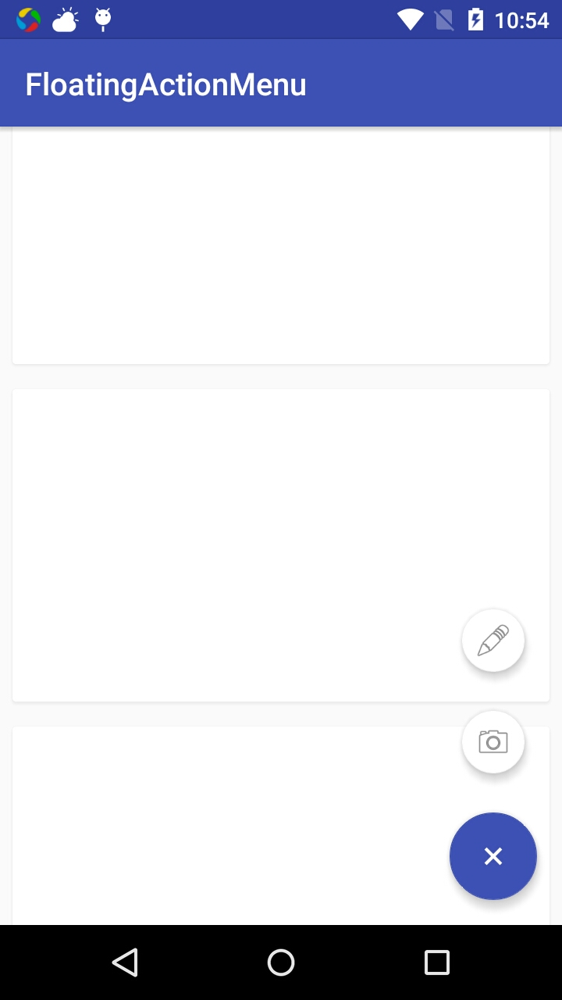
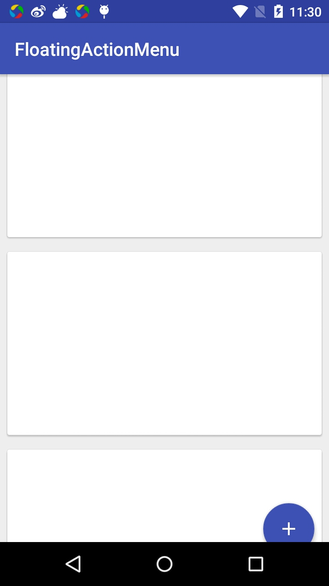

# FloatingActionMenu
FloatingActionMenu is a custom widget which manipulate multiple FloatingActionButtons from support design libs.

## Expand ##
FloatingActionMenu expands its FloatingActionButtons with default OvershootInterpolator, and create a dim white background.



## Scroll with RecyclerView ##
FloatingActionMenu's inner class Behavior implements CoordinatorLayout.Behavior<FloatingActionMenu>, it dectects RecyclerView scroll events by default. 



## Usage ##
* Layout

	Add as many as FloatingActionButtons you want in FloatingActionMenu, but please make sure the last one is the primary FloatingActionButton(Usually the biggest one)

	```xml
	<com.leon.floatingactionmenu.widget.FloatingActionMenu
        android:id="@+id/fab_menu"
        android:layout_width="wrap_content"
        android:layout_height="wrap_content"
        android:layout_gravity="bottom|end"
        app:layout_behavior="com.leon.floatingactionmenu.behavior.ScrollBehavior">

        <android.support.design.widget.FloatingActionButton
            android:id="@+id/fab_camera"
            android:layout_width="wrap_content"
            android:layout_height="wrap_content"
            android:src="@android:drawable/ic_menu_camera"
            android:layout_gravity="center"
            app:backgroundTint="@android:color/white"
            app:fabSize="mini" />

        <android.support.design.widget.FloatingActionButton
            android:id="@+id/fab_gallery"
            android:layout_width="wrap_content"
            android:layout_height="wrap_content"
            android:layout_gravity="center"
            android:src="@android:drawable/ic_menu_edit"
            app:backgroundTint="@android:color/white"
            app:fabSize="mini" />

        <android.support.design.widget.FloatingActionButton
            android:id="@+id/fab_add"
            android:layout_width="wrap_content"
            android:layout_height="wrap_content"
            android:layout_gravity="center"
            android:layout_margin="@dimen/fab_margin"
            android:src="@drawable/ic_add_white"
            app:backgroundTint="@color/colorPrimary" />
    </com.leon.floatingactionmenu.widget.FloatingActionMenu>
	```

* Behavior

	You should give FloatingActionMenu a scroll behavior in xml if you want it react to a RecyclerView. You can just create a class extends Behavior.

	```java
	public class ScrollBehavior extends FloatingActionMenu.Behavior {

    	public ScrollBehavior(Context context, AttributeSet attributeSet) {
        	super();
   	 	}
	}
	```
* Listeners

	You can set listeners to listener FloatingActionButton Click event.
	```java
	FloatingActionMenu floatingActionMenu = (FloatingActionMenu) findViewById(R.id.fab_menu);
        floatingActionMenu.setOnMenuItemClickListener(new FloatingActionMenu.OnMenuItemClickListener() {
            @Override
            public void onMenuItemClick(FloatingActionButton fab) {
                Toast.makeText(MainActivity.this, "OnMenuItemClick", Toast.LENGTH_SHORT).show();
            }
        });
  	```